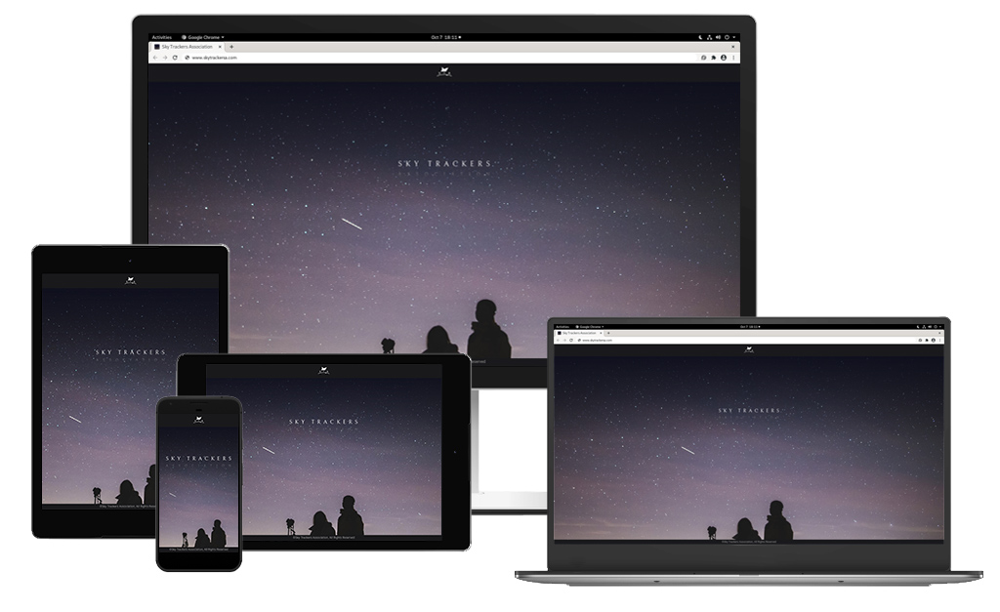

# Sky Trackers Association




**_Live preview_** on
[github page](https://exipso.github.io/sta/)   

Table Of Contents

- [Overview](#overview)
- [Design](#design)
    - [UX](#ux)
    - [Visuals](#visuals)
- [Features](#features)
- [Contributing](#contributing)
- [Tech Used](#tech-used)


## Overview

Sky Trackers Association goal is to promote astronomy to young audience. Raising curiosity about what's beyond our 
atmosphere, understand better our planet and how it is unique.


## Design

This web app is dedicated to teenagers and their parents joining their night sky explorations. I've choose to build a
sci-fi look with a light weight interface. The idea is to give a feeling of using high tech console to access information without 
distracting the young audience from the content and focus on the learning purpose. Avoid information and visual overload.  

### UX

**Personas**

- Evan:
	Teenager with curiosity for the night sky and what’s up there in deep space !

- Eleanor:
	Eleanor is a young female teacher in mid school. She wants to use materials accessible to young audience and high quality 
	images to raise her class interest in astronomy, related sciences and what it leads to. Hopefully will raise curiosity of some to find out more

**User Stories**

- As Evan I want to learn about planets of our solar system so that I can enjoy more watching the bright ones at night.  

- As Eleanor I want to poke my students with an experience about what it is to study in astronomy.  

**Wireframes & prototyping**

I've [sketched](./ux_documentation/sketches) few concepts that answer these main guidelines before building an 
[animated wireframe prototype](https://xd.adobe.com/view/28ab82c9-8297-45c1-6aff-7a57d62f62a1-5e9a/?fullscreen) with AdobeXD. 
PDF version [here](./ux_documentation/sta_prototyping.pdf).  

__As this project is supposed to stay a simple frontend application, the scope was downscaled. However before this project came up
I have planned already to write a data driven full-stack app, and I WILL !__

[To top](#sky-trackers-association)

### Visuals

**Color Scheme**  

The colors are split in 3 categories:
- Background  
    Dark greenish-cyan desaturated color. Graphics/fonts should be dimmed not to take over the main UI. Coming from 
    futuristic digital display, gradient to purplish color will introduce some interesting yet subtle contrast in the bg color.
- Main UI / HUD  
    Warm color range to contrast with the background and echo with our sun's light temperature.
- Interactive elements  
    Bright and highly saturated colors standing out in the HUD to guide the young audience with available interactions.

The table below shows the main colors pallet :

| Background  | HUD | Interactive |
| ------------- | ------------- | ------------- |
|  `#202b34` dark cyan  |  `#21131e` console bg #1 |  `#4181f1` enabled |
|  `#273835` dark green  |  `#231414` console bg #2 |  `#F15641` cancel/error |
|  `#19191c` dark blue |  `#f6eec8` warm backlight |  |
|  `#0e0f1d` deep sky |  `#a9bdc4` cool backlight |

**Graphics**  

Graphics should have a futuristic / sci-fi look without being complex. It is not a movie screen graphics but information
display to young audience therefore should not contain too many distracting elements that make the reading and learning harder.  
Same goes for animations and transitions.

**Photographs & schematics**

High quality photographs are necessary to engage young audience. They should be inspiring and relevant to the section they illustrate.  

**Fonts**  

- Logo  
    Logo should represent the vision of STA.  
    I chose [Bellefair](https://fonts.google.com/specimen/Bellefair) for its elegant and timeless latin typeface with a
    light weight expressing humility and patience.
- Titles  
    Strong body font that stands from the main text without adding too much weight nor complexity.  
    [Barlow Condensed](https://fonts.google.com/specimen/Barlow+Condensed).
- Main text  
    Easy to read font without serif. [Roboto](https://fonts.google.com/specimen/Roboto) is almost inevitable.
- Graphic fonts  
    Preferably hard to read futuristic font as it is not intended to be read but part of HUD graphics. Title font could
    be used, desaturated and dimmed. Else remove all graphic text from HUD. I've chosen [Saira Condesed](https://fonts.google.com/specimen/Saira+Condensed)
    as supporting gfx font.  


[To top](#sky-trackers-association)


## Features

### Existing Features

- About page gives basic information on STA activities and social accounts to stay tuned (demo only to external links).  
- Contact form on about page allows users to send queries, book events, etc (no backend for this demo).  
- Explore page gives basic information on our solar system main objects in a very simplistic way.  
- Ease scrolling on 'Explore' page for better UX.  

### Features to implement

- Side navbar on Explore page to ease scrolling between sections.  

### Further development

- 3D model view of planets.  
- Celestial bodies data card in console.  


[To top](#sky-trackers-association)


## Contributing

### Running the project locally

1. You first need to fork the repo
   ```bash
   git clone https://github.com/exipso/sta.git
   ```

2. Install Sass in project directories (Dev Dependency in package.json)
    ```bash
   npm install
    ```

3. Run script to watch SCSS file changes & auto compile to CSS
    ```bash
   npm run sass
    ```

### Deployment

This simple Front-End project is deployed on github pages.

1. In the github repository's settings scroll down to Github Pages section
2. Choose the source branch and optionally the specific directory in which lies the app. (root in this case).
3. Save. The app should be deployed at ` https://<user_name>.github.io/<repo_name> `.

## Testing

Every pages successfully passed the [W3C HTML validation tool](https://validator.w3.org/#validate_by_input+with_options).  
Same for the compiled ` main.css ` with the [W3C CSS validation tool](http://jigsaw.w3.org/css-validator/#validate_by_input).

This app have been tested on different devices & browsers:
- Devices
    - Android smartphone & tablets
    - Apple smartphone
    - Desktop
- Browsers
    - Firefox (80)
    - Chrome (85)

The responsiveness have also been testing in FF and Chrome using the developer tools
and different device settings.

### Navigation

Each pages navbar links lead to the appropriate page (and back to itself).
Accurate feedback for the active page is given to the user.

### Explore scrolling

Each section navigates from one to another using prev/next buttons.
They all scroll to the appropriate section

### About page's contact form

While there is no backend to manage nor send the form data, the validation prevents
the modal feedback to show if any of the following is not given:
- Username with letters only.
- Email with appropriate format.
- Some characters in the message area.

### Acceptance Tests

- Evan's user story.  
    1. The landing page offers a single call to action for the website core ' Explore and learn ' button.  
    2. Evan is then on the main page with a brief intro and the ' explore ' button.  
    He can click the button and use the prev/next buttons of each section (celestial bodies) or scroll down to 
    any planet of the solar system.  

- Eleanor's user story.
    1. From the landing page I can click the menu icon to access the about page.  
    2. After reading a brief intro of STA activities I can fill the contact form to ask for a scholar group visit.  
    3. A message feedback appears to confirm my query was sent. (For this demo: no backend, no data treatment).  


[To top](#sky-trackers-association)


## Tech Used

- [SASS](https://sass-lang.com) for styling.
- [Bootstrap4](https://getbootstrap.com/) to set up our basic template layout.
- [jQuery](https://jquery.com/) library is required for Bootstrap4 and used for DOM manipulation and subtle animations.  


### Software

- [PyCharm](https://www.jetbrains.com/pycharm/)  
    My favorite IDE even for Front-End projects.
- [GitKraken](https://www.gitkraken.com/)  
    Handy to visualize the commit tree, stashes, diff split view etc. It is an essential tool in my workflow along with PyCharm VCS.
- [Krita](https://krita.org/en)  
    To compress images.


[To top](#sky-trackers-association)


## Credits

### Maintainer

[My Self](https://github.com/exipso)

### Content

Content was written by myself with updated data from [NASA](https://www.nasa.gov/).

### Media

Celestial bodies photographs comes from [NASA](https://www.nasa.gov/multimedia/imagegallery/index.html).
Others were found on [unsplash](https://unsplash.com/).

### Acknowledgement

My mentor [Aaron Sinnott](https://github.com/aaronsnig501) for his continuous support and precious advice.


[To top](#sky-trackers-association)
